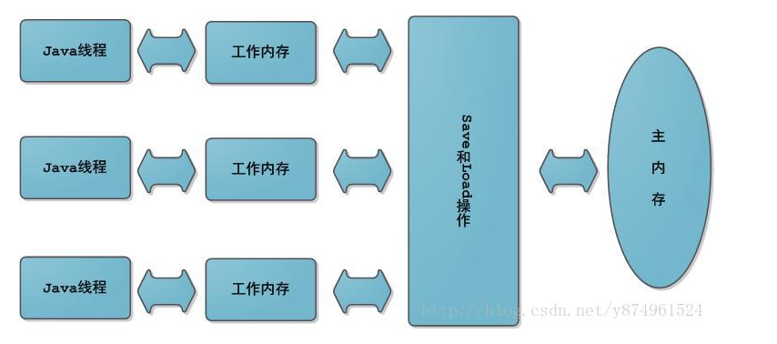

什么是Java内存模型
Java虚拟机规范中试图定义一种Java内存模型（Java Memory Model，JMM）来屏蔽掉各种硬件和操作系统的访问差异，以实现让Java程序在各种平台下都能达到一致的内存访问效果。在此之前，主流程序语言（如C/C++等）直接使用物理硬件和操作系统的内存模型，因此，会由于不同平台上内存模型的差异，有可能导致程序在一套平台上并发完全正常，而在另外一套平台上并发访问却经常出错，因此在某些场景下就不许针对不同的平台来编写程序。

Java内存模型即要定义得足够严谨，才能让Java的并发内存访问操作不会产生歧义；Java内存模型也必须定义地足够宽松，才能使得虚拟机的实现有足够的自由空间去利用硬件的各种特性来获取更好的执行速度。经过长时间的验证和修补，JDK1.5（实现了JSR-133）发布之后，Java内存模型已经成熟和完善起来了，一起来看一下。

__主内存和工作内存__

Java内存模型的主要目的是定义程序中各个变量的访问规则，即在虚拟机中将变量存储到内存和从内存中取出变量这样的底层细节。注意一下，此处的变量并不包括局部变量与方法参数，因为它们是线程私有的，不会被共享，自然也不会存在竞争，此处的变量应该是实例字段、静态字段和构成数组对象的元素。

Java内存模型规定了所有的变量都存储在主内存（Main Memory）中，每条线程还有自己的工作内存（Working Memory），线程的工作内存中保存了被该线程使用到的变量和主内存副本拷贝（注意这里绝不会是整个对象的拷贝，试想一个10M的对象，在每个用到这个对象的工作内存中有一个10M的拷贝，内存还受得了？也就是一些在线程中用到的对象中的字段罢了），线程对变量所有的操作（读取、赋值）都必须在工作内存中进行，而不能直接读写主内存中的变量。不同的线程之间也无法直接访问对方工作内存中的变量，线程间变量值的传递均需要通过主内存来完成，线程、主内存、工作内存三者的交互关系如图：

 

__内存间相互交互__

关于主内存与工作内存之间具体的交互协议，即一个变量如何从主内存拷贝到工作内存、如何从工作内存同步回主内存之类的实现细节，Java内存模型中定义了以下8种操作来完成，虚拟机实现时必须保证下面体积的每一种操作都是原子的、不可再分的：

1、lock（锁定）：作用于主内存中的变量，它把一个变量标识为一条线程独占的状态

2、unlock（解锁）：作用于主内存中的变量，它把一个处于锁定状态的变量释放出来，释放后的变量才可以被其他线程锁定

3、read（读取）：作用于主内存中的变量，它把一个变量的值从主内存传输到线程的工作内存中，以便随后的load动作使用

4、load（载入）：作用于工作内存的变量，它把read操作从主内存中得到的变量值放入工作内存的变量副本中

5、use（使用）：作用于工作内存的变量，它把工作内存中一个变量的值传递给执行引擎，没当虚拟机遇到一个需要使用到变量的值的字节码指令时将会执行这个操作

6、assign（赋值）：作用于工作内存中的变量，它把一个从执行引擎接收到的值赋值给工作内存中的变量，每当虚拟机遇到一个给变量赋值的字节码指令时执行这个操作

7、store（存储）：作用于工作内存中的变量，它把工作内存中一个变量的值传送到主内存中，以便随后的write操作使用

8、write（写入）：作用于主内存中的变量，它把store操作从工作内存中得到的变量值放入主内存的变量中

__Java内存模型还规定了在执行上述8种基本操作时必须满足以下规则：__

1、不允许read和load、store和write操作之一单独出现

2、不允许一个线程丢弃它的最近的assign操作，即变量在工作内存中改变了滞后必须把该变化同步回主内存

3、不允许一个线程无原因地把数据从线程的工作内存同步回主内存中

4、一个新的变量只能从主内存中诞生，不允许在工作内存中直接使用一个未被初始化（load或assign）的变量

5、一个变量在同一时刻只允许一条线程对其进行lock操作，但lock操作可以被同一条线程重复执行多次，多次执行lock后，只有执行相同次数的unlock操作，变量才会被解锁

6、如果对同一个变量执行lock操作，那将会清空工作内存中此变量的值，在执行引擎使用这个变量前，需要重新执行load或assign操作初始化变量的值

7、如果一个变量事先没有被lock操作锁定，那就不允许对它进行unlock操作，也不允许去unlock一个被其他线程锁定的变量

8、对一个变量执行unlock操作之前，必须先把此变量同步回主内存中

__volatile型变量的特殊规则__

关键字volatile可以说是Java虚拟机提供的最轻量级的同步机制。

一个变量被定义为volatile后，它将具备两种特性：

1、保证此变量对所有线程的”可见性”，所谓”可见性”是指当一条线程修改了这个变量的值，新值对于其它线程来说都是可以立即得知的，而普通变量不能做到这一点，普通变量的值在在线程间传递均需要通过主内存来完成，关于volatile关键字的操作请参见volatile关键字使用举例，再强调一遍，volatile只保证了可见性，并不保证基于volatile变量的运算在并罚下是安全的

2、使用volatile变量的第二个语义是禁止指令重排序优化，普通变量仅仅会保证在该方法的执行过程中所有依赖赋值结果的地方都能获取到正确的结果，而不能保证变量赋值操作的顺序与程序代码中的执行顺序一致。

总结一下Java内存模型对volatile变量定义的特殊规则：

1、在工作内存中，每次使用某个变量的时候都必须线从主内存刷新最新的值，用于保证能看见其他线程对该变量所做的修改之后的值

2、在工作内存中，每次修改完某个变量后都必须立刻同步回主内存中，用于保证其他线程能够看见自己对该变量所做的修改

3、volatile修饰的变量不会被指令重排序优化，保证代码的执行顺序与程序顺序相同

__原子性、可见性、有序性__

Java内存模型围绕着并发过程中如何处理原子性、可见性和有序性这三个特征来建立的，来逐个看一下：

1、原子性（Atomicity）

由Java内存模型来直接保证原子性变量操作包括read、load、assign、use、store、write，大致可以认为基本数据类型的访问读写是具备原子性的。如果应用场景需要一个更大的原子性保证，Java内存模型还提供了lock和unlock，尽管虚拟机没有把lock和unlock操作直接开放给用户使用，但是却提供了更高层次的字节码指令monitorenter和monitorexit来隐式地使用这两个操作，这两个字节码指令反映到Java代码中就是同步块—-synchronized关键字

2、可见性（Visibility）

可见性是指当一个线程修改了共享变量的值，其他线程能够立即得知这个修改。volatile其实已经详细写了这一点，其实synchronized关键字也是可以实现可见性的，synchronized的可见性是由”对一个变量执行unlock操作之前，必须先把此变量同步回主内存中”这条规则获得的。另外，final关键字也可以实现可见性，因为被final修饰的字段在构造器中一旦初始化完成，并且构造器没有把this传递出去，那在其他线程中就能看见final字段的值。

3、有序性（Ordering）

Java程序中天然的有序性可以总结为一句话：如果在本线程内观察，所有的操作都是有序的；如果在一个线程中观察另外一个线程，所有的操作都是无须的。前半句是指”线程内表现为穿行的语义”，后半句是指”指令重排序”和”工作内存与主内存同步延迟”现象。Java语言提供了volatile和synchronized两个关键字来保证线程之间操作的有序性，volatile关键字本身就包含了禁止指令重排序的语义，而synchronized则是由”一个变量在同一时刻只允许一条线程对其进行lock操作”这条规则获得的，这条规则规定了持有同一个锁的两个同步块只能串行地进入

__先行发生happens-before原则__

如果Java内存模型中所有的有序性都仅仅靠volatile和synchronized来完成，那么有一些操作将变得很繁琐，但是我们在编写Java代码时并未感觉到这一点，这是因为Java语言中有一个”先行发生（happens-before）”原则。这个原则非常重要，它是判断数据是否存在竞争、线程是否安全的主要依据，依靠这个原则，我们可以通过几条规则就判断出并发环境下两个操作之间是否可能存在冲突的问题。

所谓先行发生原则是指Java内存模型中定义的两项操作之间的偏序关系，如果说操作A先行发生于操作B，那么操作A产生的影响能够被操作b观察到，”影响”包括修改了内存中共享变量的值、发送了消息、调用了方法等。Java内存模型下有一些天然的，不需要任何同步协助器就已经存在的先行发生关系：

1、程序次序规则：在一个线程内，按照控制流顺序，控制流前面的操作先行发生于控制流后面的操作，说”控制流”是因为还要考虑到分支、循环结构

2、管程锁定规则：一个unlock操作先行发生于后面对同一个锁的lock操作

3、volatile变量规则：对一个volatile变量的写操作先行发生于后面对这个变量的读操作

4、线程启动规则：Thread对象的start()方法先行发生于此线程的每一个动作

5、线程终止规则：线程中的所有操作都先行发生于对此线程的终止检测

6、线程中断规则：对线程interrupt()方法的调用先行发生于被中断线程的代码检测到中断事件的发生

7、对象终结规则：一个对象的初始化完成先行发生于它的finalize()方法的开始

8、传递新：如果操作A先行发生于操作B，操作B先行发生于操作C，那么操作A必然先行发生于操作C

Java语言无须任何同步手段保障就能成立的先行发生规则就只有上面这些额，如果两个操之间的关系不在此列，并且无法通过下面规则推导出来的话，它们就没有顺序性保障。举一个例子来看一下：
```java
private int i = 0;
 
public void setI(int i)
{
    this.i = i;
}
 
public int getI()
{
    return i;
}
```
很普通的一组getter/setter，假设A线程先调用了setI(1)，B线程再调用了同一个对象的getI()，那么B线程的返回值是什么？

依次分析一下先行发生原则中的各项规则。由于两个方法分别由两个线程分别调用，因此程序次序规则这里不适用；由于没有同步块，所以也就没有unlock和lock，因此管程锁定规则这里不适用；i没有被关键字volatile修饰，因此volatile变量规则这里不适用；后面的启动、终止、中断、对象终结也和这里完全没有关系，因此也都不适用。因为没有一个实用的先行发生规则，所以最后一条传递性也无从谈起，因此传递性也不适用。由于所有先行发生原则都不适用，因此尽管线程A的setI(1)操作在时间上先发生，但无法确定线程B的getI()的返回结果，换句话说，这里面的操作不是线程安全的。

那如何修复这个问题？至少有两种比较简单的办法：

1、setter/getter都定义成synchronized的，这样可以套用管程锁定规则

2、i定义为volatile变量，由于setter方法对i的修改不依赖于i的原值，满足volatile关键字的使用场景，这样可以套用volatile变量规则
