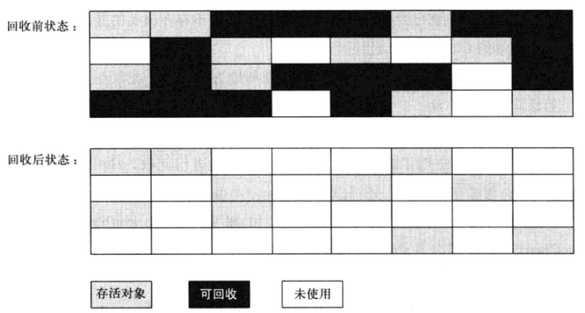
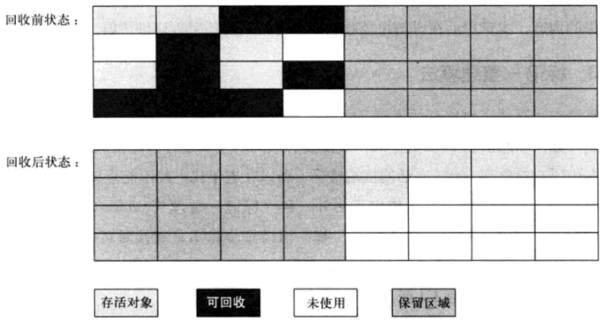
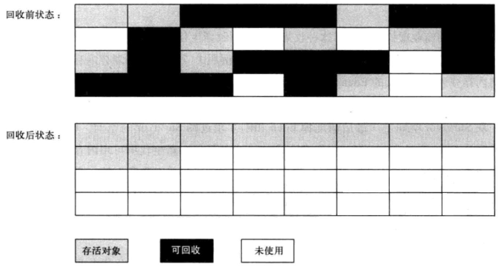
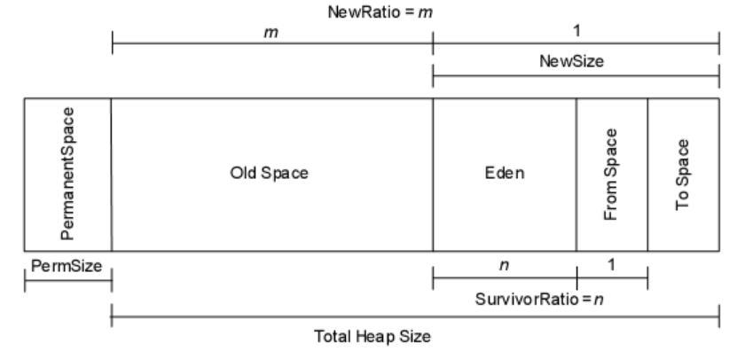
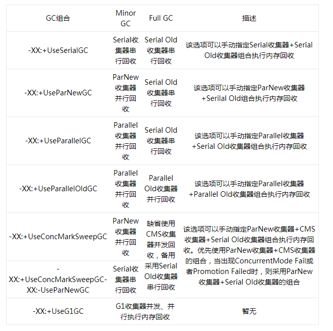

哪些内存需要回收？
哪些内存需要回收是垃圾回收机制第一个要考虑的问题，所谓“要回收的垃圾”无非就是那些不可能再被任何途径使用的对象。那么如何找到这些对象？

1、引用计数法

这个算法的实现是，给对象中添加一个引用计数器，每当一个地方引用这个对象时，计数器值+1；
当引用失效时，计数器值-1。任何时刻计数值为0的对象就是不可能再被使用的。这种算法使用场景很多，但是，
Java中却没有使用这种算法，因为这种算法很难解决对象之间相互引用的情况。看一段代码：
```java
/**
 * 虚拟机参数：-verbose:gc
 */
public class ReferenceCountingGC
{
    private Object instance = null;
    private static final int _1MB = 1024 * 1024;
 
    /** 这个成员属性唯一的作用就是占用一点内存 */
    private byte[] bigSize = new byte[2 * _1MB];
 
    public static void main(String[] args)
    {
        ReferenceCountingGC objectA = new ReferenceCountingGC();
        ReferenceCountingGC objectB = new ReferenceCountingGC();
        objectA.instance = objectB;
        objectB.instance = objectA;
        objectA = null;
        objectB = null;
 
        System.gc();
    }
}
```
看下运行结果：
```java
[GC 4417K->288K(61440K), 0.0013498 secs]
[Full GC 288K->194K(61440K), 0.0094790 secs]
```
看到，两个对象相互引用着，但是虚拟机还是把这两个对象回收掉了，这也说明虚拟机并不是通过引用计数法来判定对象是否存活的。

2、可达性分析法

这个算法的基本思想是通过一系列称为“GC Roots”的对象作为起始点，从这些节点向下搜索，搜索所走过的路径称为引用链，当一个对象到GC Roots没有任何引用链（即GC Roots到对象不可达）时，则证明此对象是不可用的。在Java语言中可以作为GC Roots的对象包括：

· 虚拟机栈中引用的对象

· 方法区中静态属性引用的对象

· 方法区中常量引用的对象

· 本地方法栈中JNI（即Native方法）引用的对象

4种引用状态
在JDK1.2之前，Java中引用的定义很传统：如果引用类型的数据中存储的数值代表的是另一块内存的起始地址，就称这块内存代表着一个引用。这种定义很纯粹，但是太过于狭隘，一个对象只有被引用或者没被引用两种状态。我们希望描述这样一类对象：当内存空间还足够时，则能保留在内存中；如果内存空间在进行垃圾收集后还是非常紧张，则可以抛弃这些对象。很多系统的缓存功能都符合这样的应用场景。在JDK1.2之后，Java对引用的概念进行了扩充，将引用分为强引用、软引用、弱引用、虚引用4种，这4种引用强度依次减弱。

1、强引用

代码中普遍存在的类似”Object obj = new Object()”这类的引用，只要强引用还存在，垃圾收集器永远不会回收掉被引用的对象

2、软引用

描述有些还有用但并非必需的对象。在系统将要发生内存溢出异常之前，将会把这些对象列进回收范围进行二次回收。如果这次回收还没有足够的内存，才会抛出内存溢出异常。Java中的类SoftReference表示软引用

3、弱引用

描述非必需对象。被弱引用关联的对象只能生存到下一次垃圾回收之前，垃圾收集器工作之后，无论当前内存是否足够，都会回收掉只被弱引用关联的对象。Java中的类WeakReference表示弱引用

4、虚引用

这个引用存在的唯一目的就是在这个对象被收集器回收时收到一个系统通知，被虚引用关联的对象，和其生存时间完全没关系。Java中的类PhantomReference表示虚引用

方法区回收
虚拟机规范中不要求方法区一定要实现垃圾回收，而且方法区中进行垃圾回收的效率也确实比较低，但是HotSpot对方法区也是进行回收的，主要回收的是废弃常量和无用的类两部分。判断一个常量是否“废弃常量”比较简单，只要当前系统中没有任何一处引用该常量就好了，但是要判定一个类是否“无用的类”条件就要苛刻很多，类需要同时满足以下三个条件：

1、该类所有实例都已经被回收，也就是说Java堆中不存在该类的任何实例

2、加载该类的ClassLoader已经被回收

3、该类对应的java.lang.Class对象没有在任何地方被引用，无法在任何地方通过反射访问该类的方法

在大量使用反射、动态代理、CGLib等ByteCode框架、动态生成JSP以及OSGi这类频繁自定义ClassLoader的场景都需要虚拟机具备类卸载功能，以保证方法区不会溢出。

垃圾回收算法
第一步考量了哪些对象进行回收后，第二步自然是如何对对象进行回收了。这里主要写几种垃圾回收算法的思想。

1、标记-清除（Mark-Sweep）算法

这是最基础的算法，标记-清除算法就如同它的名字样，分为“标记”和“清除”两个阶段：首先标记出所有需要回收的对象，标记完成后统一回收所有被标记的对象。这种算法的不足主要体现在效率和空间，从效率的角度讲，标记和清除两个过程的效率都不高；从空间的角度讲，标记清除后会产生大量不连续的内存碎片， 内存碎片太多可能会导致以后程序运行过程中在需要分配较大对象时，无法找到足够的连续内存而不得不提前触发一次垃圾收集动作。标记-清除算法执行过程如图：


2、复制（Copying）算法

复制算法是为了解决效率问题而出现的，它将可用的内存分为两块，每次只用其中一块，当这一块内存用完了，就将还存活着的对象复制到另外一块上面，然后再把已经使用过的内存空间一次性清理掉。这样每次只需要对整个半区进行内存回收，内存分配时也不需要考虑内存碎片等复杂情况，只需要移动指针，按照顺序分配即可。复制算法的执行过程如图：


不过这种算法有个缺点，内存缩小为了原来的一半，这样代价太高了。现在的商用虚拟机都采用这种算法来回收新生代，不过研究表明1:1的比例非常不科学，因此新生代的内存被划分为一块较大的Eden空间和两块较小的Survivor空间，每次使用Eden和其中一块Survivor。每次回收时，将Eden和Survivor中还存活着的对象一次性复制到另外一块Survivor空间上，最后清理掉Eden和刚才用过的Survivor空间。HotSpot虚拟机默认Eden区和Survivor区的比例为8:1，意思是每次新生代中可用内存空间为整个新生代容量的90%。当然，我们没有办法保证每次回收都只有不多于10%的对象存活，当Survivor空间不够用时，需要依赖老年代进行分配担保（Handle Promotion）。

3、标记-整理（Mark-Compact）算法

复制算法在对象存活率较高的场景下要进行大量的复制操作，效率很低。万一对象100%存活，那么需要有额外的空间进行分配担保。老年代都是不易被回收的对象，对象存活率高，因此一般不能直接选用复制算法。根据老年代的特点，有人提出了另外一种标记-整理算法，过程与标记-清除算法一样，不过不是直接对可回收对象进行清理，而是让所有存活对象都向一端移动，然后直接清理掉边界以外的内存。标记-整理算法的工作过程如图：


分代收集
根据上面的内容，用一张图概括一下堆内存的布局

现代商用虚拟机基本都采用分代收集算法来进行垃圾回收。这种算法没什么特别的，无非是上面内容的结合罢了，根据对象的生命周期的不同将内存划分为几块，然后根据各块的特点采用最适当的收集算法。大批对象死去、少量对象存活的，使用复制算法，复制成本低；对象存活率高、没有额外空间进行分配担保的，采用标记-清理算法或者标记-整理算法。

垃圾收集器
垃圾收集器就是上面讲的理论知识的具体实现了。不同虚拟机所提供的垃圾收集器可能会有很大差别，我们使用的是HotSpot，HotSpot这个虚拟机所包含的所有收集器如图：


上图展示了7种作用于不同分代的收集器，如果两个收集器之间存在连线，那说明它们可以搭配使用。虚拟机所处的区域说明它是属于新生代收集器还是老年代收集器。多说一句，我们必须要明白一个道理：没有最好的垃圾收集器，更加没有万能的收集器，只能选择对具体应用最合适的收集器。这也是HotSpot为什么要实现这么多收集器的原因。OK，下面一个一个看一下收集器：

1、Serial收集器

最基本、发展历史最久的收集器，这个收集器是一个采用复制算法的单线程的收集器，单线程一方面意味着它只会使用一个CPU或一条线程去完成垃圾收集工作，另一方面也意味着它进行垃圾收集时必须暂停其他线程的所有工作，直到它收集结束为止。后者意味着，在用户不可见的情况下要把用户正常工作的线程全部停掉，这对很多应用是难以接受的。不过实际上到目前为止，Serial收集器依然是虚拟机运行在Client模式下的默认新生代收集器，因为它简单而高效。用户桌面应用场景中，分配给虚拟机管理的内存一般来说不会很大，收集几十兆甚至一两百兆的新生代停顿时间在几十毫秒最多一百毫秒，只要不是频繁发生，这点停顿是完全可以接受的。

2、ParNew收集器

ParNew收集器其实就是Serial收集器的多线程版本，除了使用多条线程进行垃圾收集外，其余行为和Serial收集器完全一样，包括使用的也是复制算法。ParNew收集器除了多线程以外和Serial收集器并没有太多创新的地方，但是它却是Server模式下的虚拟机首选的新生代收集器，其中有一个很重要的和性能无关的原因是，除了Serial收集器外，目前只有它能与CMS收集器配合工作（看图）。CMS收集器是一款几乎可以认为有划时代意义的垃圾收集器，因为它第一次实现了让垃圾收集线程与用户线程基本上同时工作。ParNew收集器在单CPU的环境中绝对不会有比Serial收集器更好的效果，甚至由于线程交互的开销，该收集器在两个CPU的环境中都不能百分之百保证可以超越Serial收集器。当然，随着可用CPU数量的增加，它对于GC时系统资源的有效利用还是很有好处的。它默认开启的收集线程数与CPU数量相同，在CPU数量非常多的情况下，可以使用-XX:ParallelGCThreads参数来限制垃圾收集的线程数。

3、Parallel收集器

Parallel收集器也是一个新生代收集器，也是用复制算法的收集器，也是并行的多线程收集器，但是它的特点是它的关注点和其他收集器不同。介绍这个收集器主要还是介绍吞吐量的概念。CMS等收集器的关注点是尽可能缩短垃圾收集时用户线程的停顿时间，而Parallel收集器的目标则是打到一个可控制的吞吐量。所谓吞吐量的意思就是CPU用于运行用户代码时间与CPU总消耗时间的比值，即吞吐量=运行用户代码时间/（运行用户代码时间+垃圾收集时间），虚拟机总运行100分钟，垃圾收集1分钟，那吞吐量就是99%。另外，Parallel收集器是虚拟机运行在Server模式下的默认垃圾收集器。

停顿时间短适合需要与用户交互的程序，良好的响应速度能提升用户体验；高吞吐量则可以高效率利用CPU时间，尽快完成运算任务，主要适合在后台运算而不需要太多交互的任务。

虚拟机提供了-XX:MaxGCPauseMillis和-XX:GCTimeRatio两个参数来精确控制最大垃圾收集停顿时间和吞吐量大小。不过不要以为前者越小越好，GC停顿时间的缩短是以牺牲吞吐量和新生代空间换取的。由于与吞吐量关系密切，Parallel收集器也被称为“吞吐量优先收集器”。Parallel收集器有一个-XX:+UseAdaptiveSizePolicy参数，这是一个开关参数，这个参数打开之后，就不需要手动指定新生代大小、Eden区和Survivor参数等细节参数了，虚拟机会根据当亲系统的运行情况手机性能监控信息，动态调整这些参数以提供最合适的停顿时间或者最大的吞吐量。如果对于垃圾收集器运作原理不太了解，以至于在优化比较困难的时候，使用Parallel收集器配合自适应调节策略，把内存管理的调优任务交给虚拟机去完成将是一个不错的选择。

4、Serial Old收集器

Serial收集器的老年代版本，同样是一个单线程收集器，使用“标记-整理算法”，这个收集器的主要意义也是在于给Client模式下的虚拟机使用。

5、Parallel Old收集器

Parallel收集器的老年代版本，使用多线程和“标记-整理”算法。这个收集器在JDK 1.6之后的出现，“吞吐量优先收集器”终于有了比较名副其实的应用组合，在注重吞吐量以及CPU资源敏感的场合，都可以优先考虑Parallel收集器+Parallel Old收集器的组合。

6、CMS收集器

CMS收集器是一种以获取最短回收停顿时间为目标的老年代收集器。目前很大一部分Java应用集中在互联网站或者B/S系统的服务端上，这类应用尤其注重服务的响应速度，希望系统停顿时间最短，以给用户带来较好的体验，CMS收集器就非常符合这类应用的需求。CMS收集器从名字就能看出是基于“标记-清除”算法实现的。

7、G1收集器

G1（Garbage-First）收集器是当今收集器技术发展的最前沿成果之一，JDK 7 Update 4后开始进入商用。在G1收集器之前的其他收集器进行收集的范围都是整个新生代或者老年代，而G1收集器不再是这样，使用G1收集器时，Java堆的内存布局就与其他收集器有很大差别，它将整个Java堆分为多个大小相等的独立区域（Region），虽然还保留有新生代和老年代的概念，但新生代和老年代不再是物理隔离的了，它们都是一部分Region的集合。G1收集器跟踪各个Region里面的垃圾堆积的价值大小，在后台维护一个优先列表，每次根据允许的收集时间，优先回收价值最大的Region（这也是Garbage-First名称的由来）。这种使用Region划分内存空间以及有优先级的区域回收方式，保证了G1收集器在有限的时间内可以获取尽可能高的收集效率。

垃圾收集器总结
来看一下对垃圾收集器的总结，列了一张表


GC日志
每种收集器的日志形式都是由它们自身的实现所决定的，换言之，每种收集器的日志格式都可以不一样。不过虚拟机为了方便用户阅读，将各个收集器的日志都维持了一定的共性，就以最前面的对象间相互引用的那个类ReferenceCountingGC的代码为例：

虚拟机参数为“-XX:+PrintGCDetails -XX:+UseSerialGC”，使用Serial+Serial Old组合进行垃圾回收的日志
```java
[GC [DefNew: 310K->194K(2368K), 0.0269163 secs] 310K->194K(7680K), 0.0269513 secs] [Times: user=0.00 sys=0.00, real=0.03 secs] 
[GC [DefNew: 2242K->0K(2368K), 0.0018814 secs] 2242K->2241K(7680K), 0.0019172 secs] [Times: user=0.00 sys=0.00, real=0.00 secs] 
[Full GC (System) [Tenured: 2241K->193K(5312K), 0.0056517 secs] 4289K->193K(7680K), [Perm : 2950K->2950K(21248K)], 0.0057094 secs] [Times: user=0.00 sys=0.00, real=0.00 secs] 
Heap
 def new generation   total 2432K, used 43K [0x00000000052a0000, 0x0000000005540000, 0x0000000006ea0000)
  eden space 2176K,   2% used [0x00000000052a0000, 0x00000000052aaeb8, 0x00000000054c0000)
  from space 256K,   0% used [0x00000000054c0000, 0x00000000054c0000, 0x0000000005500000)
  to   space 256K,   0% used [0x0000000005500000, 0x0000000005500000, 0x0000000005540000)
 tenured generation   total 5312K, used 193K [0x0000000006ea0000, 0x00000000073d0000, 0x000000000a6a0000)
   the space 5312K,   3% used [0x0000000006ea0000, 0x0000000006ed0730, 0x0000000006ed0800, 0x00000000073d0000)
 compacting perm gen  total 21248K, used 2982K [0x000000000a6a0000, 0x000000000bb60000, 0x000000000faa0000)
   the space 21248K,  14% used [0x000000000a6a0000, 0x000000000a989980, 0x000000000a989a00, 0x000000000bb60000)
No shared spaces configured.
```
虚拟机参数为“-XX:+PrintGCDetails -XX:+UseParNewGC”，使用ParNew+Serial Old组合进行垃圾回收的日志

```java
[GC [ParNew: 310K->205K(2368K), 0.0006664 secs] 310K->205K(7680K), 0.0007043 secs] [Times: user=0.00 sys=0.00, real=0.00 secs] 
[GC [ParNew: 2253K->31K(2368K), 0.0032525 secs] 2253K->2295K(7680K), 0.0032911 secs] [Times: user=0.00 sys=0.00, real=0.00 secs] 
[Full GC (System) [Tenured: 2264K->194K(5312K), 0.0054415 secs] 4343K->194K(7680K), [Perm : 2950K->2950K(21248K)], 0.0055105 secs] [Times: user=0.00 sys=0.00, real=0.01 secs] 
Heap
 par new generation   total 2432K, used 43K [0x0000000005550000, 0x00000000057f0000, 0x0000000007150000)
  eden space 2176K,   2% used [0x0000000005550000, 0x000000000555aeb8, 0x0000000005770000)
  from space 256K,   0% used [0x0000000005770000, 0x0000000005770000, 0x00000000057b0000)
  to   space 256K,   0% used [0x00000000057b0000, 0x00000000057b0000, 0x00000000057f0000)
 tenured generation   total 5312K, used 194K [0x0000000007150000, 0x0000000007680000, 0x000000000a950000)
   the space 5312K,   3% used [0x0000000007150000, 0x0000000007180940, 0x0000000007180a00, 0x0000000007680000)
 compacting perm gen  total 21248K, used 2982K [0x000000000a950000, 0x000000000be10000, 0x000000000fd50000)
   the space 21248K,  14% used [0x000000000a950000, 0x000000000ac39980, 0x000000000ac39a00, 0x000000000be10000)
No shared spaces configured.
```
虚拟机参数为“-XX:+PrintGCDetails -XX:+UseParallelGC”，使用Parallel+Serial Old组合进行垃圾回收的日志
```java
[GC [PSYoungGen: 4417K->288K(18688K)] 4417K->288K(61440K), 0.0007910 secs] [Times: user=0.00 sys=0.00, real=0.00 secs] 
[Full GC (System) [PSYoungGen: 288K->0K(18688K)] [PSOldGen: 0K->194K(42752K)] 288K->194K(61440K) [PSPermGen: 2941K->2941K(21248K)], 0.0032663 secs] [Times: user=0.02 sys=0.00, real=0.00 secs] 
Heap
 PSYoungGen      total 18688K, used 321K [0x0000000034190000, 0x0000000035660000, 0x0000000048f90000)
  eden space 16064K, 2% used [0x0000000034190000,0x00000000341e05c0,0x0000000035140000)
  from space 2624K, 0% used [0x0000000035140000,0x0000000035140000,0x00000000353d0000)
  to   space 2624K, 0% used [0x00000000353d0000,0x00000000353d0000,0x0000000035660000)
 PSOldGen        total 42752K, used 194K [0x000000000a590000, 0x000000000cf50000, 0x0000000034190000)
  object space 42752K, 0% used [0x000000000a590000,0x000000000a5c0810,0x000000000cf50000)
 PSPermGen       total 21248K, used 2982K [0x0000000005190000, 0x0000000006650000, 0x000000000a590000)
  object space 21248K, 14% used [0x0000000005190000,0x0000000005479980,0x0000000006650000)
 ```
虚拟机参数为“-XX:+PrintGCDetails -XX:+UseConcMarkSweepGC”，使用ParNew+CMS+Serial Old组合进行垃圾回收的日志

```java
[Full GC (System) [CMS: 0K->194K(62656K), 0.0080796 secs] 4436K->194K(81792K), [CMS Perm : 2941K->2940K(21248K)], 0.0081589 secs] [Times: user=0.01 sys=0.00, real=0.01 secs] 
Heap
 par new generation   total 19136K, used 340K [0x0000000005540000, 0x0000000006a00000, 0x0000000006a00000)
  eden space 17024K,   2% used [0x0000000005540000, 0x0000000005595290, 0x00000000065e0000)
  from space 2112K,   0% used [0x00000000065e0000, 0x00000000065e0000, 0x00000000067f0000)
  to   space 2112K,   0% used [0x00000000067f0000, 0x00000000067f0000, 0x0000000006a00000)
 concurrent mark-sweep generation total 62656K, used 194K [0x0000000006a00000, 0x000000000a730000, 0x000000000a940000)
 concurrent-mark-sweep perm gen total 21248K, used 2981K [0x000000000a940000, 0x000000000be00000, 0x000000000fd40000)
 ```
这四段GC日志中提炼出一些共性：

1、日志的开头“GC”、“Full GC”表示这次垃圾收集的停顿类型，而不是用来区分新生代GC还是老年代GC的。如果有Full，则说明本次GC停止了其他所有工作线程。看到Full GC的写法是“Full GC(System)”，这说明是调用System.gc()方法所触发的GC。

2、“GC”中接下来的“DefNew”、“ParNew”、“PSYoungGen”、“CMS”表示的是老年代垃圾收集器的名称，“PSYoungGen”中的“PS”指的是“Parallel Scavenge”，它是Parallel收集器的全称。

3、以第一个为例，方括号内部的“320K->194K(2368K)”、“2242K->0K(2368K)”，指的是该区域已使用的容量->GC后该内存区域已使用的容量(该内存区总容量)。方括号外面的“310K->194K(7680K)”、“2242K->2241K(7680K)”则指的是GC前Java堆已使用的容量->GC后Java堆已使用的容量(Java堆总容量)。

4、还以第一个为例，再往后“0.0269163 secs”表示该内存区域GC所占用的时间，单位是秒。最后的“[Times: user=0.00 sys=0.00 real=0.03 secs]”则更具体了，user表示用户态消耗的CPU时间、内核态消耗的CPU时间、操作从开始到结束经过的钟墙时间。后面两个的区别是，钟墙时间包括各种非运算的等待消耗，比如等待磁盘I/O、等待线程阻塞，而CPU时间不包括这些耗时，但当系统有多CPU或者多核的话，多线程操作会叠加这些CPU时间所以如果user或sys超过real是完全正常的。

5、“Heap”后面就列举出堆内存目前各个年代的区域的内存情况

触发GC的时机
最后总结一下什么时候会触发一次GC，个人经验看，有三种场景会触发GC：

1、第一种场景应该很明显，当年轻代或者老年代满了，Java虚拟机无法再为新的对象分配内存空间了，那么Java虚拟机就会触发一次GC去回收掉那些已经不会再被使用到的对象

2、手动调用System.gc()方法，通常这样会触发一次的Full GC以及至少一次的Minor GC

3、程序运行的时候有一条低优先级的GC线程，它是一条守护线程，当这条线程处于运行状态的时候，自然就触发了一次GC了。这点也很好证明，不过要用到WeakReference的知识，后面写WeakReference的时候会专门讲到这个。
